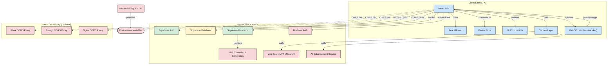

```mermaid
flowchart TD
    %% Netlify Hosting
    Netlify("Netlify Hosting & CDN"):::external
    EnvVars(["Environment Variables"]):::external
    Netlify -->|provides| EnvVars

    %% Client Side
    subgraph "Client Side (SPA)" 
        direction TB
        ReactApp["React SPA"]:::frontend
        Router["React Router"]:::frontend
        Store["Redux Store"]:::frontend
        Components["UI Components"]:::frontend
        ServicesLayer["Service Layer"]:::frontend
        Worker["Web Worker (tavusWorker)"]:::frontend

        ReactApp -->|uses| Router
        ReactApp -->|connects to| Store
        ReactApp -->|renders| Components
        ReactApp -->|calls| ServicesLayer
        ReactApp -->|spawns| Worker
        Worker -->|postMessage| ReactApp
    end

    %% Server Side / BaaS
    subgraph "Server Side & BaaS"
        direction TB
        SupabaseAuth["Supabase Auth"]:::backend
        SupabaseDB["Supabase Database"]:::database
        SupabaseFunc["Supabase Functions"]:::backend
        PDFService["PDF Extraction & Generation"]:::external
        FirebaseAuth["Firebase Auth"]:::external
        JobAPI["Job Search API (JSearch)"]:::external
        AIService["AI Enhancement Service"]:::external

        ReactApp -->|HTTPS / RPC| SupabaseAuth
        ReactApp -->|HTTPS / RPC| SupabaseDB
        ReactApp -->|invoke| SupabaseFunc
        ReactApp -->|authenticate| FirebaseAuth
        ServicesLayer -->|calls| JobAPI
        ServicesLayer -->|calls| AIService
        SupabaseFunc -->|invokes| PDFService
    end

    %% Development CORS Proxies
    subgraph "Dev CORS Proxy (Optional)"
        direction TB
        Flask["Flask CORS Proxy"]:::external
        Django["Django CORS Proxy"]:::external
        Nginx["Nginx CORS Proxy"]:::external

        ReactApp -.->|CORS dev| Flask
        ReactApp -.->|CORS dev| Django
        ReactApp -.->|CORS dev| Nginx
    end

    %% Click Events for Frontend
    click ReactApp "https://github.com/agilepartners-ai/aijobsearchagent/blob/main/src/main.tsx"
    click ReactApp "https://github.com/agilepartners-ai/aijobsearchagent/blob/main/src/App.tsx"
    click Netlify "https://github.com/agilepartners-ai/aijobsearchagent/blob/main/netlify.toml"
    click ReactApp "https://github.com/agilepartners-ai/aijobsearchagent/blob/main/package.json"
    click Router "https://github.com/agilepartners-ai/aijobsearchagent/blob/main/src/App.tsx"
    click Store "https://github.com/agilepartners-ai/aijobsearchagent/blob/main/src/store/store.ts"
    click Components "https://github.com/agilepartners-ai/aijobsearchagent/tree/main/src/components/"
    click ServicesLayer "https://github.com/agilepartners-ai/aijobsearchagent/tree/main/src/services/"
    click Worker "https://github.com/agilepartners-ai/aijobsearchagent/blob/main/src/workers/tavusWorker.ts"
    click Worker "https://github.com/agilepartners-ai/aijobsearchagent/blob/main/public/tavusWorker.js"

    %% Click Events for Services
    click JobAPI "https://github.com/agilepartners-ai/aijobsearchagent/blob/main/src/services/jobSearchService.ts"
    click AIService "https://github.com/agilepartners-ai/aijobsearchagent/blob/main/src/services/aiEnhancementService.ts"
    click ServicesLayer "https://github.com/agilepartners-ai/aijobsearchagent/blob/main/src/services/pdfExtractionService.ts"
    click ServicesLayer "https://github.com/agilepartners-ai/aijobsearchagent/blob/main/src/services/pdfGenerationService.ts"
    click ServicesLayer "https://github.com/agilepartners-ai/aijobsearchagent/blob/main/src/services/resumeOptimizationService.ts"
    click ServicesLayer "https://github.com/agilepartners-ai/aijobsearchagent/blob/main/src/services/interviewService.ts"
    click ServicesLayer "https://github.com/agilepartners-ai/aijobsearchagent/blob/main/src/services/supabaseAuthService.ts"
    click ServicesLayer "https://github.com/agilepartners-ai/aijobsearchagent/blob/main/src/services/supabaseJobPreferencesService.ts"
    click ServicesLayer "https://github.com/agilepartners-ai/aijobsearchagent/blob/main/src/services/supabaseJobApplicationService.ts"

    %% Click Events for Auth & Hooks
    click FirebaseAuth "https://github.com/agilepartners-ai/aijobsearchagent/blob/main/src/hooks/useAuth.ts"
    click Components "https://github.com/agilepartners-ai/aijobsearchagent/blob/main/src/components/auth/LoginForm.tsx"
    click Components "https://github.com/agilepartners-ai/aijobsearchagent/blob/main/src/components/auth/RegisterForm.tsx"
    click Components "https://github.com/agilepartners-ai/aijobsearchagent/blob/main/src/components/auth/VerifyPhone.tsx"
    click Components "https://github.com/agilepartners-ai/aijobsearchagent/blob/main/src/components/auth/ForgotPassword.tsx"
    click Components "https://github.com/agilepartners-ai/aijobsearchagent/blob/main/src/components/auth/ProtectedRoute.tsx"

    %% Click Events for Supabase Function
    click SupabaseFunc "https://github.com/agilepartners-ai/aijobsearchagent/blob/main/src/supabase/functions/resume-proxy/index.ts"

    %% Click Events for Dev Proxies
    click Flask "https://github.com/agilepartners-ai/aijobsearchagent/blob/main/server/flask_app.py"
    click Django "https://github.com/agilepartners-ai/aijobsearchagent/blob/main/server/django_cors_settings.py"
    click Nginx "https://github.com/agilepartners-ai/aijobsearchagent/blob/main/server/nginx_cors_config.conf"

    %% Styles
    classDef frontend fill:#cce5ff,stroke:#000
    classDef backend fill:#d4edda,stroke:#000
    classDef database fill:#fff3cd,stroke:#000
    classDef external fill:#f8d7da,stroke:#000  
```
